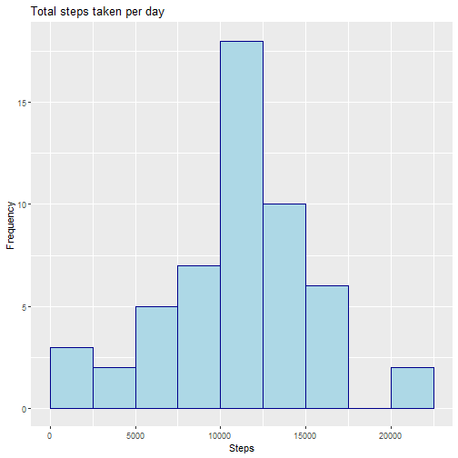

Reproducible Research Course Project 1
======================================

January 22, 2021.
**Emirrio Renaldie Hartland**


## Loading and preprocessing the data

```r
library(ggplot2)

unzip("./activity.zip")
activity <- read.csv("./activity.csv")
summary(activity)
```

```
##      steps                date          interval     
##  Min.   :  0.00   2012-10-01:  288   Min.   :   0.0  
##  1st Qu.:  0.00   2012-10-02:  288   1st Qu.: 588.8  
##  Median :  0.00   2012-10-03:  288   Median :1177.5  
##  Mean   : 37.38   2012-10-04:  288   Mean   :1177.5  
##  3rd Qu.: 12.00   2012-10-05:  288   3rd Qu.:1766.2  
##  Max.   :806.00   2012-10-06:  288   Max.   :2355.0  
##  NA's   :2304     (Other)   :15840
```

```r
names(activity)
```

```
## [1] "steps"    "date"     "interval"
```

```r
head(activity)
```

```
##   steps       date interval
## 1    NA 2012-10-01        0
## 2    NA 2012-10-01        5
## 3    NA 2012-10-01       10
## 4    NA 2012-10-01       15
## 5    NA 2012-10-01       20
## 6    NA 2012-10-01       25
```

## What is mean total number of steps taken per day?

**1. Calculate the total number of steps taken per day**

```r
steps_day <- aggregate(activity$steps, list(activity$date), FUN=sum)
colnames(steps_day) <- c("Date", "Steps")
head(steps_day)
```

```
##         Date Steps
## 1 2012-10-01    NA
## 2 2012-10-02   126
## 3 2012-10-03 11352
## 4 2012-10-04 12116
## 5 2012-10-05 13294
## 6 2012-10-06 15420
```

**2. Make a histogram of the total number of steps taken per day**

```r
ggplot(steps_day, aes(Steps)) + 
    geom_histogram(binwidth = 2500, boundary = 0, col = "darkblue", fill = "lightblue") +
    ggtitle("Total steps taken per day") +
    ylab("Frequency")
```

```
## Warning: Removed 8 rows containing non-finite values (stat_bin).
```



**3. Calculate and report the mean and median of the total number of steps taken per day**

```r
# Mean
mean(steps_day$Steps, na.rm = TRUE)
```

```
## [1] 10766.19
```

```r
# Median
median(steps_day$Steps, na.rm = TRUE)
```

```
## [1] 10765
```

## What is the average daily activity pattern?

**1. Make a time series plot (i.e. \color{red}{\verb|type = "l"|}type = "l") of the 5-minute interval (x-axis) and the average number of steps taken, averaged across all days (y-axis)**

```r
steps_time <- aggregate(steps ~ interval, activity, FUN=mean)
ggplot(steps_time, aes(interval, steps)) +
    geom_line(col = "darkblue") +
    ggtitle("Avergae daily activity pattern") +
    xlab("Interval") + ylab("Steps")
```


**2. Which 5-minute interval, on average across all the days in the dataset, contains the maximum number of steps?**

```r
steps_time[which.max(steps_time$steps), ]$interval
```

```
## [1] 835
```

## Imputing missing values

**1. Calculate and report the total number of missing values in the dataset (i.e. the total number of rows with \color{red}{\verb|NA|}NAs)**

```r
sum(is.na(activity$steps))
```

```
## [1] 2304
```

**2. Devise a strategy for filling in all of the missing values in the dataset. The strategy does not need to be sophisticated. For example, you could use the mean/median for that day, or the mean for that 5-minute interval, etc.**

```r
steps_time_mean <- function(interval){
    steps_time[steps_time$interval==interval,]$steps
    }
```

**3. Create a new dataset that is equal to the original dataset but with the missing data filled in**

```r
imputed_activity <- activity
for(i in 1:nrow(imputed_activity)){
    if(is.na(imputed_activity[i,]$steps)){
    imputed_activity[i,]$steps <- steps_time_mean(imputed_activity[i,]$interval)}
    }
```

**4. Make a histogram of the total number of steps taken each day and Calculate and report the mean and median total number of steps taken per day. Do these values differ from the estimates from the first part of the assignment? What is the impact of imputing missing data on the estimates of the total daily number of steps?**

```r
imputed_steps_day <- aggregate(imputed_activity$steps, list(imputed_activity$date), FUN=sum)
colnames(imputed_steps_day) <- c("Date", "Steps")
ggplot(imputed_steps_day, aes(Steps)) + 
    geom_histogram(binwidth = 2500, boundary = 0, col = "darkblue", fill = "lightblue") +
    ggtitle("Total steps taken per day") +
    ylab("Frequency")
```


```r
# Mean
mean(imputed_steps_day$Steps, na.rm = TRUE)
```

```
## [1] 10766.19
```

```r
#Median
median(imputed_steps_day$Steps, na.rm = TRUE)
```

```
## [1] 10766.19
```
Imputing the missing values from the data did not change the mean of the total numbers taken per day. However, the median changed very slightly from the initial value.

## Are there differences in activity patterns between weekdays and weekends?

**1. Create a new factor variable in the dataset with two levels – “weekday” and “weekend” indicating whether a given date is a weekday or weekend day**

```r
activity$date <- as.Date(strptime(activity$date, format="%Y-%m-%d"))
activity$datetype <- sapply(activity$date, function(x) {
    if (weekdays(x) == "Saturday" | weekdays(x) =="Sunday") 
    {y <- "Weekend"} else 
    {y <- "Weekday"}
    y
    })
```

**2. Make a panel plot containing a time series plot (i.e. 𝚝𝚢𝚙𝚎 = “𝚕”) of the 5-minute interval (x-axis) and the average number of steps taken, averaged across all weekday days or weekend days (y-axis)**

```r
activity_date <- aggregate(steps ~ interval + datetype, activity, mean, na.rm = TRUE)
ggplot(activity_date, aes(x = interval , y = steps, color = datetype)) +
    geom_line() +
    labs(title = "Average daily steps", x = "Interval", y = "Steps") +
    facet_wrap(~datetype, ncol = 1, nrow=2)
```


